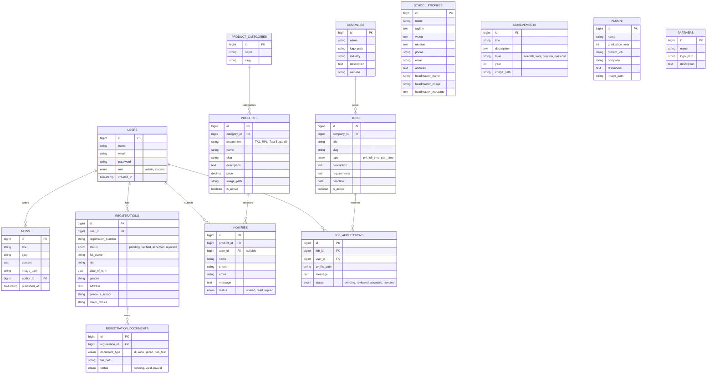

# Skema Database (MySQL) - JHIC 2.0 Web Development

Dokumen ini memuat rancangan skema database untuk memenuhi 5 fitur wajib dalam lomba JHIC 2.0.

---

## 🗺️ Entity Relationship Diagram (ERD)

---

## 📊 Detail Tabel

### 1. Autentikasi & Pengguna
- **`users`**: Tabel pengguna utama.
  - `role`: Membedakan antara `admin` (punya akses CMS) dan `student` (calon siswa/siswa yang login untuk PPDB atau melamar kerja).

### 2. Fitur 1 - Profil Sekolah (Landing Page)
Tabel-tabel ini relatif statis dan **sangat direkomendasikan untuk di-cache via Redis**.
- **`school_profiles`**: Informasi dasar sekolah (hanya butuh 1 row/record).
- **`news`**: Berita dan pengumuman sekolah. Relasi ke `users` (admin) sebagai author.
- **`achievements`**: Data prestasi siswa/sekolah.
- **`alumni`**: Profil lulusan terbaik/sukses.
- **`partners`**: Kerja sama industri (DUDI) untuk menampilkan logo mitra.

### 3. Fitur 2 - PPDB
- **`registrations`**: Data pendaftaran utama siswa baru. Satu `user` (student) idealnya hanya memiliki satu pendaftaran aktif. Memuat data diri, pilihan jurusan.
- **`registration_documents`**: Tabel relasi untuk menyimpan file dokumen syarat PPDB (KK, Akta Kelahiran, dll). Dipisah agar mudah mengelola status validasi per dokumen.

### 4. Fitur 3 - Produk Unggulan (BLUD)
- **`product_categories`**: Kategori produk.
- **`products`**: Data produk unggulan karya siswa. Memiliki kolom `department` (jurusan pembuat) dan `price`.
- **`inquiries`**: Pesan ketertarikan (order/tanya) dari pengunjung terkait suatu produk. Bisa dilakukan oleh `user` terdaftar maupun tamu (tamu = `user_id` null, pakai nama & email manual).

### 5. Fitur 4 - BKK (Pusat Karir & PKL)
- **`companies`**: Profil perusahaan mitra yang membuka lowongan/magang.
- **`jobs`**: Lowongan pekerjaan atau magang (PKL). Berelasi ke `companies`. Punya tipe khusus (`pkl` vs `full_time`).
- **`job_applications`**: Lamaran yang disubmit oleh siswa/alumni (`user`). Menyimpan path file CV dan status lamaran.

### 6. Fitur 5 - AI ChatBot
- *Catatan: AI ChatBot (Gemini) biasanya tidak memerlukan tabel khusus untuk menyimpan pesan jika kita murni menggunakan `sessionStorage` di sisi Frontend untuk memori percakapan sementara.*
- Jika di masa depan ingin menyimpan riwayat percakapan untuk analitik, bisa ditambahkan tabel `chat_sessions` dan `chat_messages`. Untuk sekarang (demi efisiensi dan performa), lebih baik tidak disimpan di DB.
